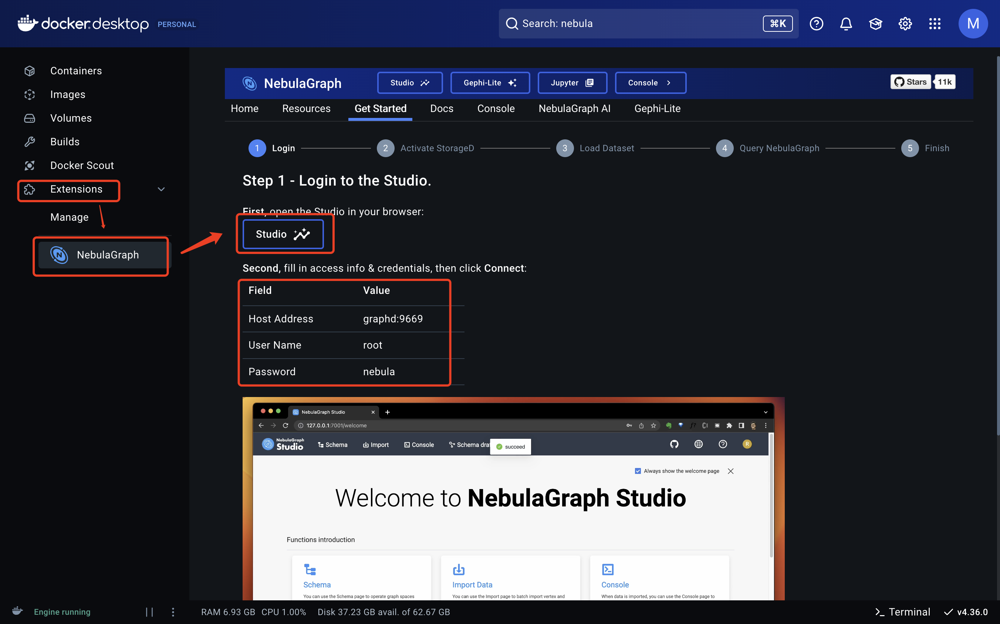

# 背景
Nebula是一款国人开发的图数据库，简单好用、试用免费、中文社区活跃，因此我选择nebula来对数据血缘关系做可视化。

以下记录在本机配置nebula的过程。

# 环境
MacBook Pro 2021
芯片：Apple M1 Pro
MacOS：14.6.1 (23G93)
Nebula官网：https://www.nebula-graph.com.cn/
Nebula网页体验版，只能大致看看：https://explorer.nebula-graph.com.cn/explorer

# 配置流程

## 第一步、安装引擎
参考这个官方文档，使用docker进行安装：https://docs.nebula-graph.com.cn/3.8.0/2.quick-start/1.quick-start-overview/

基于Docker.app在本地部署nebula，是最方便的方式。但由于Docker把大陆用户都给封禁了，导致docker.hub这个全球最大的镜像源无法连接；国内大量的镜像站也都同时挂掉，估计是担心吃官司。因此截止202412，使用这个方式遇到了连接报错的问题。

通过联系nebula官方社区，找到了解决办法。参考教程是：https://docs.nebula-graph.com.cn/3.5.0/2.quick-start/1.quick-start-overview/

另外，建议不要在Windows系统安装，在Wondows上使用Docker会很麻烦。一般推荐Mac或者Linux。
docker的安装方式下，nebula studio这个图形化界面也是自动安装的，很方便。（studio的人工安装教程是 https://docs.nebula-graph.com.cn/3.8.0/nebula-studio/deploy-connect/st-ug-deploy/）

## 第二步、启动nebula

如上图所示，在docker.app中可以直接启动nebula。然后可以在本地浏览器进入图形化界面。

## 第三步、新建空间、导入图数据
从这一步就可以导入自己的业务数据了。

## 第四步、使用图数据库
通过nGQL语句使用图数据库，这里主要是用到了nebula的可视化能力。

# 报错及处理

## 使用`docker-compose up -d`第一次启动容器时报错
报错日志为
`Error response from daemon: Head "https://registry-1.docker.io/v2/vesoft/nebula-console/manifests/v3.5": Get "https://auth.docker.io/token?account=mesong&scope=repository%3Avesoft%2Fnebula-console%3Apull&service=registry.docker.io": tls: failed to verify certificate: x509: certificate is valid for *.atlassolutions.com, *.atdmt.com, *.atdmt2.com, *.atlassbx.com, *.xx.atlassbx.com, atdmt.com, atdmt2.com, atlassbx.com, atlassolutions.com, xx.atlassbx.com, not auth.docker.io`

本质原因是网络连接不是，docker官方在202408把中国列为禁用地区，因此国内是连接不到docker官方的软件源的。参考这个文档切换可用的docker源 `https://github.com/DaoCloud/public-image-mirror/issues/2328`
